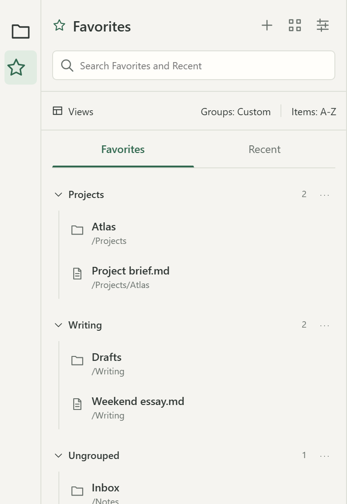
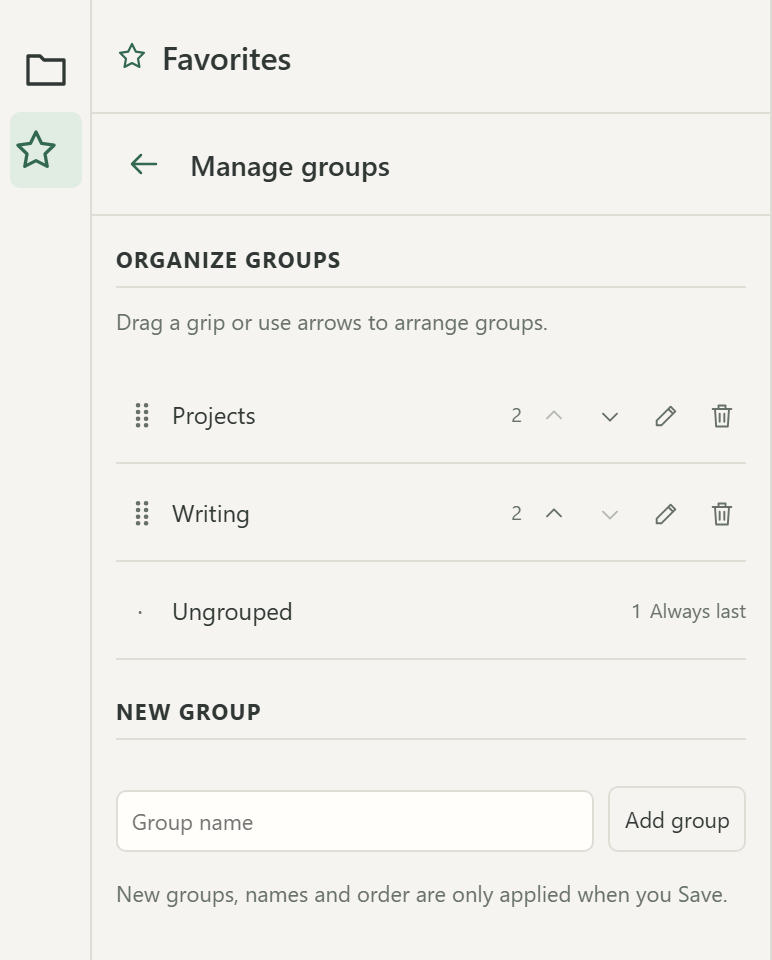
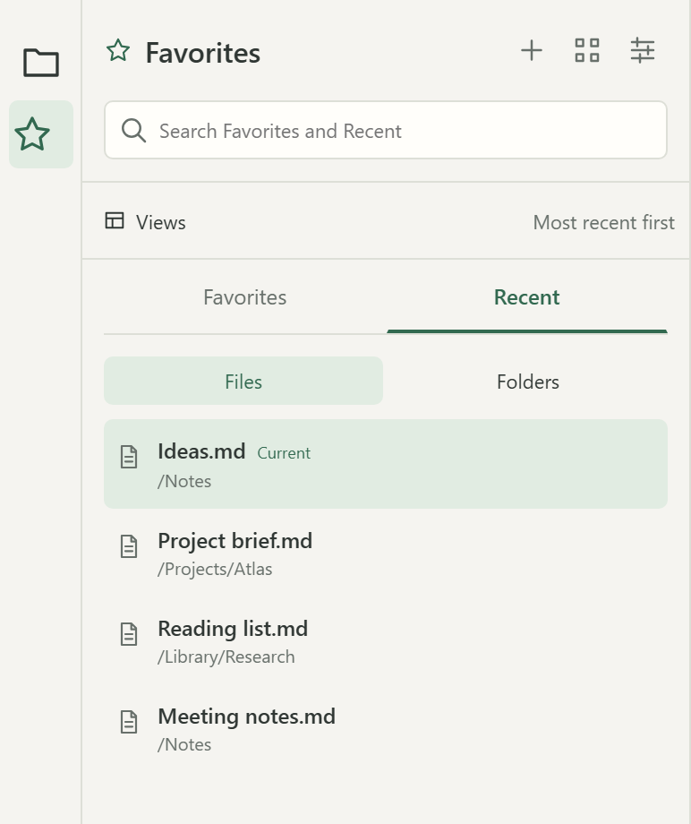
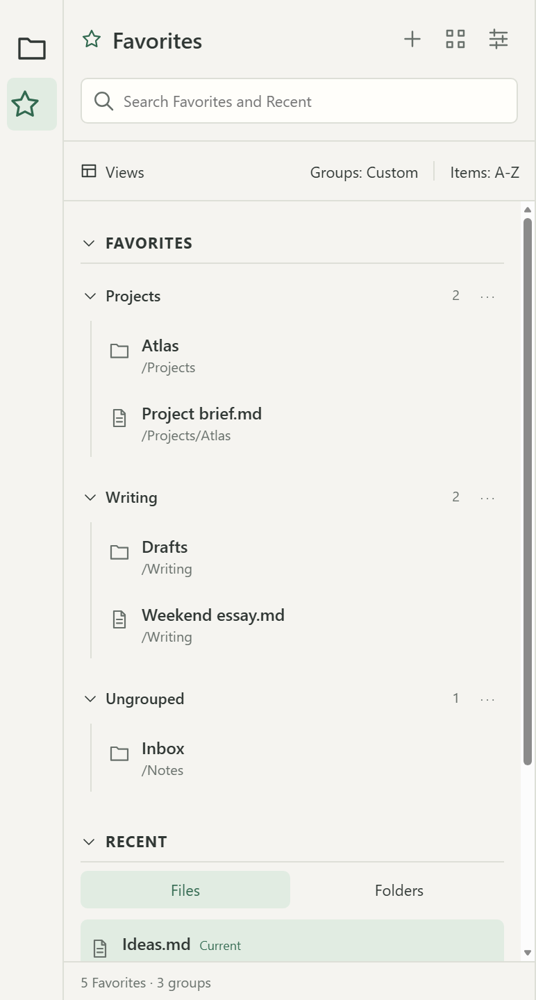
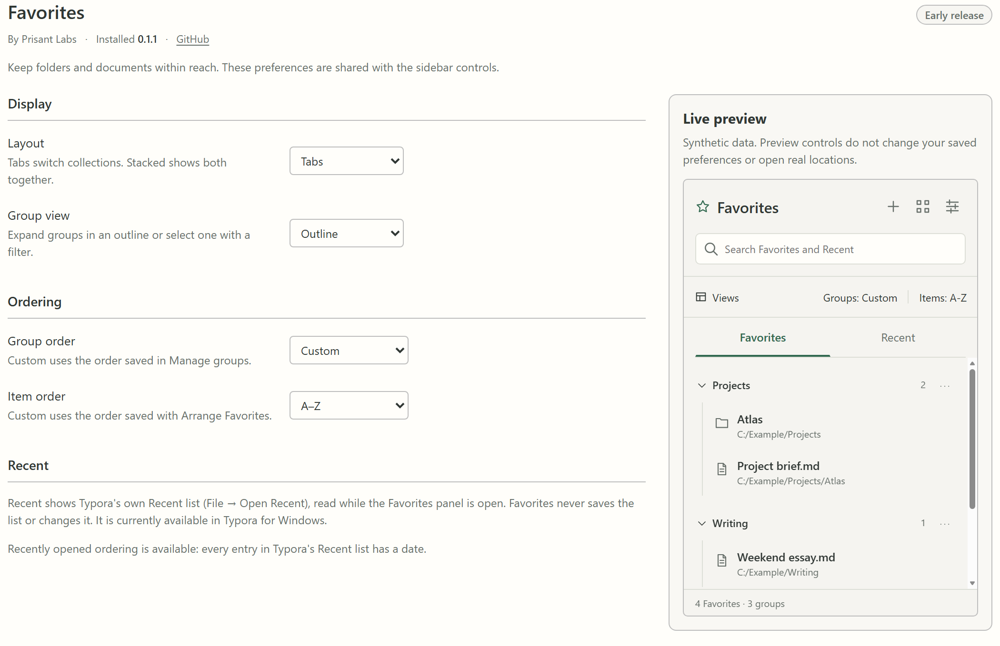

# Favorites for Typora

Keep your favorite folders and Markdown files one click away in
[Typora](https://typora.io). Favorites adds a sidebar panel where you save
shortcuts, organize them into groups, and see Typora's own Recent list
alongside them.

> **Early release.** Favorites is new. Windows is the development
> platform; macOS is supported but not yet tested natively. Please
> [report problems](https://github.com/prisant-labs/typora-plugin-favorite-folders-files/issues).

## Features

**Favorites and groups**

- Save the current document or folder with **+**, or click the star on any row.
- Group Favorites however you like. Folders and files can share a group, and
  anything without a group stays in **Ungrouped**.
- Create, rename, delete and reorder groups, and arrange the Favorites inside
  each group, on editing pages with explicit **Save** and **Cancel**.
- Removing a Favorite removes only the shortcut, and offers **Undo**. Favorites
  never moves, renames or deletes anything on disk.

**Recent** (Windows)

- Shows Typora's own Recent list (**File → Open Recent**) in **Files** and
  **Folders** tabs, with no import step. It stays current as you open files and
  folders, and it's the same in every Typora window.
- Favorites only reads the list while the panel is visible. It never saves,
  sends or changes it.

**Views, sorting and search**

- **Tabs** shows Favorites and Recent one at a time; **Stacked** shows both in
  one list.
- **Outline** lists every group; **Filter** shows one group at a time.
- Sort groups and items by **Custom** order, **A–Z**, or **Recently opened**,
  which follows Typora's Recent list.
- Search matches names and paths across Favorites and Recent.

**Opening**

- Click a file to open it, or click a folder to switch this window's file
  tree to it. The folder already open is marked **Current**.
- **Ctrl+click** opens a new window (Windows).
- The reveal button shows a file in Explorer or Finder, or opens a folder
  there.
- If a Favorite's file or folder has moved, its row is marked **Unavailable**
  and the shortcut is kept until you remove it.

**Settings**

The settings page has the same layout and sorting options as the panel, plus
a live preview that uses sample data, never your real Favorites or Recent list.

## Install

You need Typora 1.4.0 or newer, and
[Typora Community Plugin](https://github.com/typora-community-plugin/typora-community-plugin)
2.10.21 or newer, on Windows or macOS.

- **From the Plugin Marketplace** (once listed; the listing is
  [pending review](https://github.com/typora-community-plugin/typora-plugin-releases/pull/13)):
  search for **Favorites**, install it, then enable it under **Installed
  Plugins**. Until then, install manually.
- **Manually:** download `plugin.zip` from the
  [latest release](https://github.com/prisant-labs/typora-plugin-favorite-folders-files/releases/latest)
  and extract it into a folder named `prisant-labs.favorite-folders-files`
  inside your Community Plugin `plugins` folder. Restart Typora and enable
  **Favorites** under **Installed Plugins**.

Then click the **star** in Typora's left ribbon, or run **Favorites: Toggle
panel** from the command palette.

The [user guide](docs/USER-GUIDE.md) covers everyday use, how folders relate
to Community Plugin "vaults", and an FAQ.

## Privacy

- Your Favorites are stored only on this computer, in Typora's local storage
  (an IndexedDB database named `prisant-labs.favorite-folders-files`), and are
  shared by every Typora window.
- Favorites makes no network requests and collects no telemetry.
- Recent is read from Typora while the panel is visible, kept in memory, and
  never written anywhere.

## Status and known limits

- **Windows:** the maintainer has installed and exercised Favorites there. The
  full [native test checklist](docs/NATIVE-TESTING.md) is still in progress.
- **macOS:** a supported target, not yet tested natively. Recent isn't
  available on macOS yet.
- **Recently opened** sorting needs a date on every entry in Typora's Recent
  list. When some entries have none, it stays unavailable and each Recent tab
  keeps Typora's own order.
- **Upgrading from a pre-release test build:** builds before 0.1.0 used the
  plugin ID `prisant-labs.quick-access`, and their saved Favorites are not
  carried over. Remove that old plugin folder before installing.

## Development

Install dependencies with `pnpm install`. Then:

| Command | Purpose |
|---|---|
| `pnpm test:run` | Automated tests |
| `pnpm typecheck` | TypeScript checks |
| `pnpm build:dev` | Development build |
| `pnpm install:dev` | Development build installed into the synthetic `test/vault` fixture (does not launch Typora) |
| `pnpm prototype:build` / `pnpm prototype:check` | Regenerate / verify the visual anchor |
| `pnpm docs:screenshots` | Regenerate the README screenshots from the visual anchor (needs Edge or Chrome) |
| `pnpm run pack` / `pnpm release:check` | Build and validate `plugin.zip` |

[`docs/prototype/quick-access.html`](docs/prototype/quick-access.html) is a
self-contained preview that renders the production panel, model, settings and
styles with fictional data. Open it directly in a browser. CI fails if the
committed HTML differs from the current source, so every visible change must
include its regenerated preview.

The README screenshots are rendered from that preview. After a visible change,
run `pnpm prototype:build` and then `pnpm docs:screenshots`, and look at every
image before committing it. The privacy check accepts PNGs only under
`docs/images/`, and only without metadata; it can't inspect pixels, so the
visual review matters. Record user-visible changes in the
[changelog](CHANGELOG.md).

The release archive contains only `LICENSE.md`, `THIRD-PARTY-NOTICES.md`,
`main.js`, `manifest.json` and `style.css`. See
[installation and native checks](docs/NATIVE-TESTING.md).

## License

[MIT](LICENSE.md) - Copyright (c) 2026 Prisant Labs.
